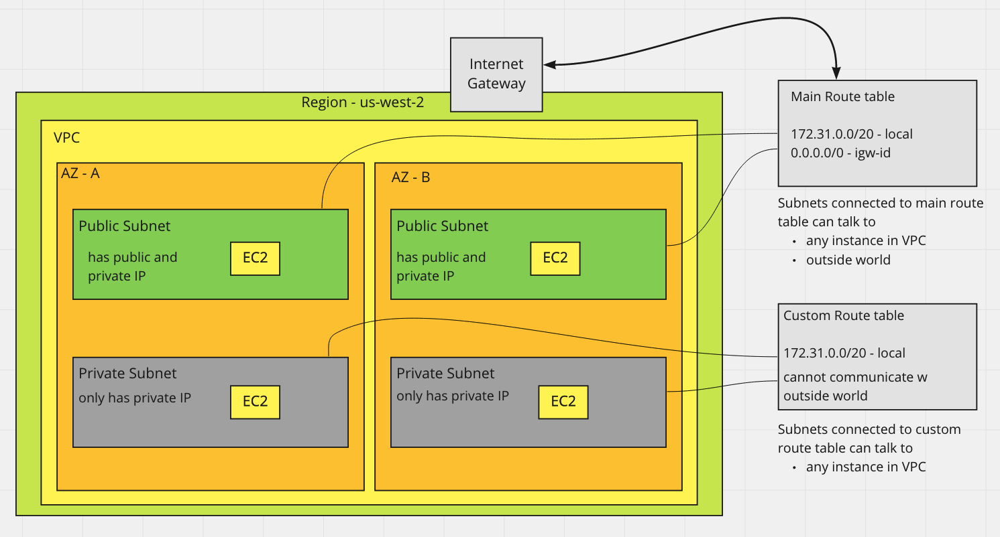

# Public, Private, and Elastic IP Addresses Overview

### Public IP Address
- lost when the instance is stopped
- if the instance is started up again you get a new public IP address
- no charge
- associated with a private IP on the instance
- cannot be moved accross instances

### Private IP Address
- retained when the instance is stopped
- what the OS sees

### Elastic IP Address
- Static public IP address
- retained when the instance is stopped
- charged if not used
- no charge if we do use them
- Can be moved between instances

---

## Network Address Translation - NAT

- When request enters VPC it is routed to Internet Gateway
- Internet Gateway performs NAT - Network Address Translation
  - Swaps public IP address (destination address) with the corresponding private IP address
  - sends request to appropriate instance

- When instance sends a response it is route to Internet Gateway
- Internet Gateway performs NAT - Network Address Translation
  - Swaps instance's private IP address with the corresponding public IP address (source address)

---

### Exercise

- Create an EC2 instance with SSH included in it's security group
- Notice the private IP address sits within the CIDR block of the containing subnet
- SSH into Instance
  - run `ifconfig`
  - see the private IP address listed under inet
  - notice no public IP address listed. Instance's OS does not know about the public IP

- In EC2 console
  - Take note of the public and private IP addresses
- Stop the instance
  - Notice the public IP goes away
- Start the instance
  - Notice there is a new public IP

---

## Public IP Address and Elanstic IP Address

- When stopping an instance
  - lose the public IP address
- When starting
  - new public IP Address

Elastic IP Address
- public facing IP address
- available on the internet
- retain IP address after starting / stopping the instance
- charged if
  - IP is not associated with an instances or an Elastic Network Adapters
  - The instance it is associated with is not running

- Can move an elastic IP address between instances and Elastic Network Adapters

## Elastic IP Addresses / Elastic Network Interfaces

- When we assign an elastic (static) IP address to an instance
  - the instance loses it's dynamic public IP address

- When you disassociate the Elastic IP address from an instance
  - instance receives a new dynamic public IP address

---

### Exercise 

- Launch 2 EC2 instances both in same subnet
- Allocate an Elastic IP Address
- Associate the Elastic IP Address to 1 EC2 instance

- Allocate new Elastic IP Address
- Create new network interface
  - MyENI
  - pick same subnet
  - Add name to network interface
- Associate Elastic IP with network interface
- Attach instance 1 to network interface
- notice in instance 1 we have
  - 2 elastic IP address
  - 2 network interface
- detach network interface from instance 1
- attach to instance 2

Clean up
- terminate EC2 instances
- after instances terminate
  - release elastic IP addresses
- delete elastic network interface

---

## Private Subnets and Bastion Hosts

- Public subnet
  - accessible from outside world
  - talks to Internet gateway
  - VPC route table has entry for the igw

- Private subnet
  - not accessible from outside world
  - does not talk to internet gateway
  - has its own route table
  - no entry for igw
  - Instances in private subnet
    - no public IP addresses
    - only private IP addresses

Bastion Host / Jump Host
- Instance in public subnet that can talk to private subnet

- sets the rsa private key
  - `ssh-add -K path/to/rsa/private/key`
  - Next time we don't need to pass in private key while ssh'ing

- Configure agent forwarding
  - ssh while also passing private key that has already be set to public instance
  - allows us to ssh from this instance to another (jump from bastion host to private instance)
  - `ssh -A ec2-user@<public-ip>`

---

### Exercise

- Explore the VPC console
  - your VPC
  - Subnets
  - route tables

- Notice
  - we already have subnets in the VPC, one for each AZ
  - we already have a route table
    - main route table
    - associated with the existing public subnets

- Create new route table
  - name - RT1
  - associate to a vpc

- Create subnet
  - name - PrivateSubnet1
  - associate vpc
  - associate to particular AZ
  - assign CIDR block for subnet
    - use subnet calculator
    - based on CIDR blocks of existing subnets in vpc but extends it

- Create second subnet
  - name - PrivateSubnet2
  - associate to different AZ

- In created Route Table - RT1
  - Associate new subnets in route table

- Launch instance into public subnet
  - give ssh
- Launch instance into private subnet
  - give ssh

- sets the rsa private key
  - `ssh-add -K path/to/rsa/private/key`

- Configure agent forwarding
  - `ssh -A ec2-user@<public-ip>`

- SSH into public instance
- SSH into private instance

- private instance cannot communicate with outside world
- try pinging google from private instance

---

## NAT Instance vs NAT Gateway

Connecting private subnets to the internet

### NAT Instance
- Assigned a security group
- Older method
- Managed by you
- Launch an EC2 instance
- confured to perform NAT
- scales up manual

### NAT Gateway
- Not assigned a security group
- Lives in public subnet
- newer method
- managed by AWS
- elasticly scales
- provides automatic high availability
- choose an elastic IP to associate with NAT Gateway

---

### Exercise

Connect a private EC2 instance with a NAT Gateway

- Create NAT gateway
  - place in public subnet
  - create new elastic IP

- Create custom route table
- Create private subnet
  - associate with custom route table
- Add route to custom route table for NAT Gateway
  - 0.0.0.0/0 - nat gateway

- Create EC2 instance in private subnet
  - ssh access

- Create EC2 instance in public subnet
  - this will be the Bastion Host

- ssh into bastion host - public EC2 instance
- from there ssh into private instance

- connect to internet
  - ping google.com
  - sudo yum update -y

Remove paid services
- Delete NAT gateway
- Release Elastic IP

---

## Private Subnet with NAT Instance

Using a public EC2 instance for allowing private instances to talk to outside world

---

### Exercise

- Create a private subnet
- Create a custom route table
  - Associate the private subnet with custom route table

- Create a private instance in private subnet

- Create the NAT Instance
  - Also functions as Bastion Host
  - Create public instance
    - Use community AMI - amzn-ami-vpc-nat
    - place in public subnet
    - Security Groups - inbound rules
      - ssh access
      - *all ICMP - IPv4 - source anywhere*
        - this will allow other instances to communicate with it
  - After public instance creation
    - Enable 'port forwarding'
      - *Allows it to function as NAT instance*
      - actions > networking > change source/destination check > yes disable

- In custom route table
  - create entry
    - 0.0.0.0/0 - point to NAT instance (by its id) 

- ssh into public instance w/ agent forwarding
- ssh into private instace
- try pinging google.com

clean up
- terminate instances
- in custom route table remove entry to NAT instace

--

## Section 3 - EC2 - Exam Cram

### EC2
- provides resizable compute capacity in cloud
- allows complete control at OS layer
- Use keypairs / public key cryptography to connect to instance
  - instance stores public key
  - you store private key
- Windows AMIs - private key required to obtain password to log into instance
- Linux AMIs - private key allows for SSH access

### User Data
- supplied by user to instance
- run at launch time
- available at http://169.254.169.254/latest/user-data/ from within instance

### Instance metadata
- IP address
- network interface
- available at http://169.254.169.254/latest/meta-data/ from within instance

### Pricing

#### On-Demand
- No upfront fees
- charged by hour / second
- no commitment
- idea for
  - short term needs
  - unpredictable workload

#### Reserved
- no upfront / partial upfront / all upfront
- charged by hour / second
- 1 or 3 year commitment
- ideal for predictable usage

#### Spot
- no upfront
- charged by hour / second
- cheapest hosting option
- service can be terminated at any time if another user outbids you
- ideal for const-sensitive, compute intensive cases that can withstand interruption

#### Dedicated Hosts and Instances

---

#### Instance Types

Different types optimized for different purposes
- general purpose
- compute optimized
- memory optimized

---

### AMI
- Regional - can only be launched from specific instance
- Info required to launch instance
  - template for root volume for instance
    - OS
    - application server
    - applications
  - Launch permissions - which accounts can use AMI to launch instance
  - block device mapping
    - specifies which volumes to attach to instance when launched
    - EBS
    - instance store
-- 

EBS
Persistent storage

Instance Storage
- not persistent / ephemeral
- use case
  - when need very high performance
  - need to be updated

---

### IP Addresses

#### Public IP Address
- dynamic IP
  - lost when instance is stoped
- used only public subnets
- used to ID instance on the internet
- free
- mapped to a private IP in the Internet Gateway

#### Private IP Address
- Retained when instance is stopped
- Used to route traffic within a VPC
- is mapped to a public IP with Internet Gateway

#### Elastic IP
- A public IP address
- static IP
  - retained when instance is stopped
- Can be moved across instances and network adapters

---

### IAM Roles

- IAM roles more secure that storing access keys on EC2 instance
- IAM roles easier to manage
- Can attach IAM roles to EC2 instance at launch time or afterwards
- Only one IAM role attached to EC2 instance at a time
IAM role can be used across regions

---

### Monitoring

- EC2 status checks
  - performed every minute
  - returns a pass or fail

- System status checks
  - problems with instance that require AWS involvement

- Instance status checks
  - problems with instance that require your involvement

- Can create CloudWatch alarms to monitor EC2 instance
 - automatically perform action if status check fails

---

### NAT Instances / NAT Gateways

[See notes above]

